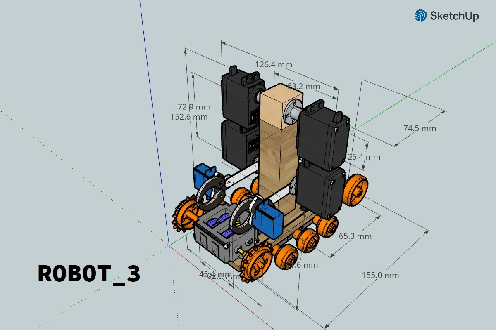
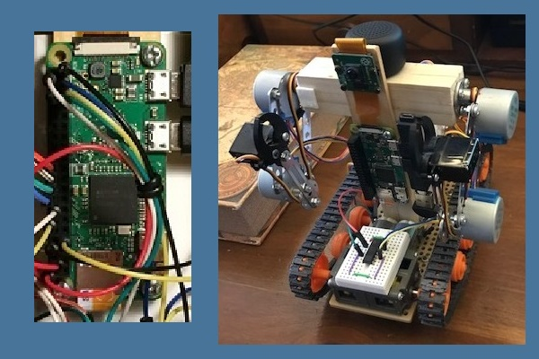
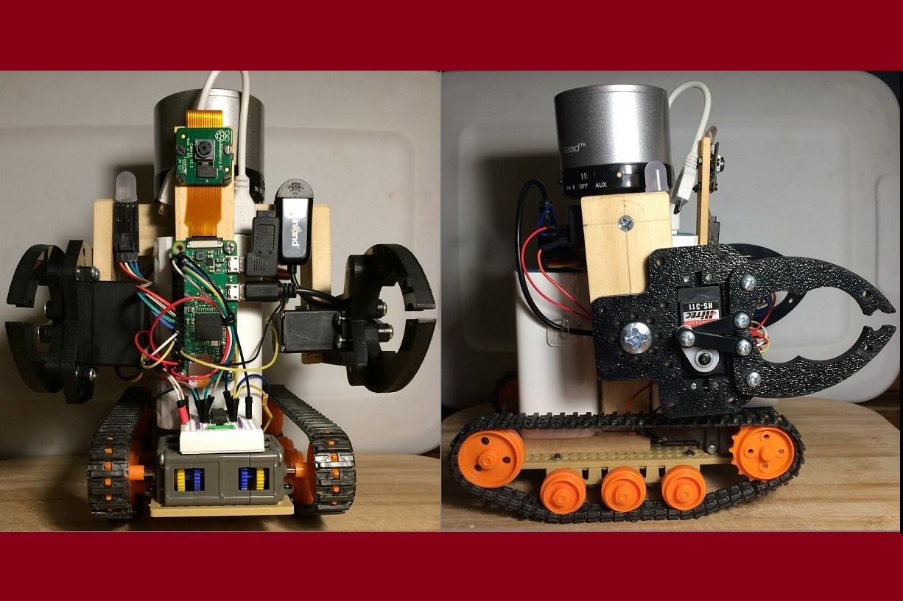
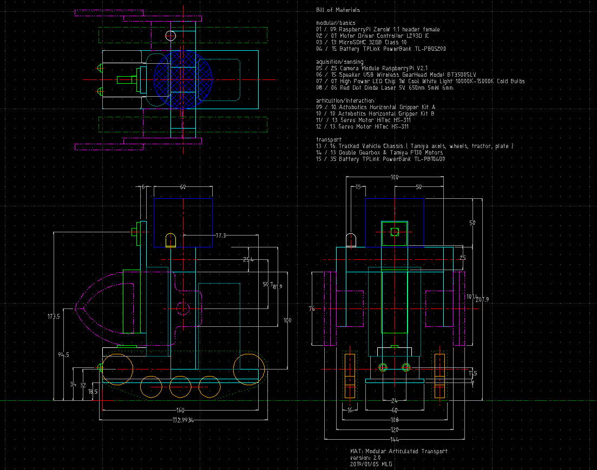
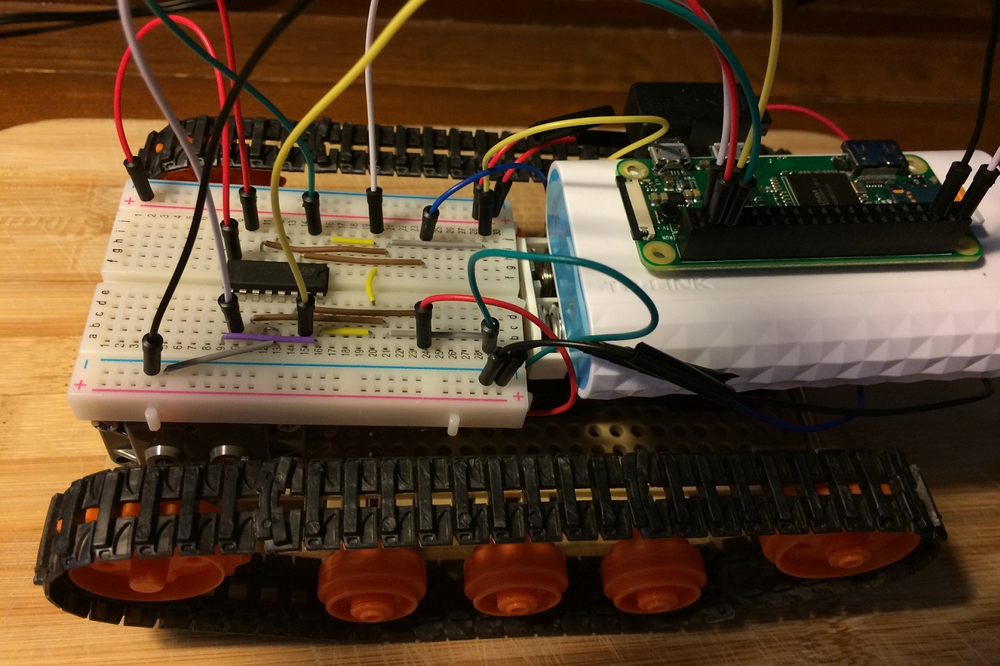
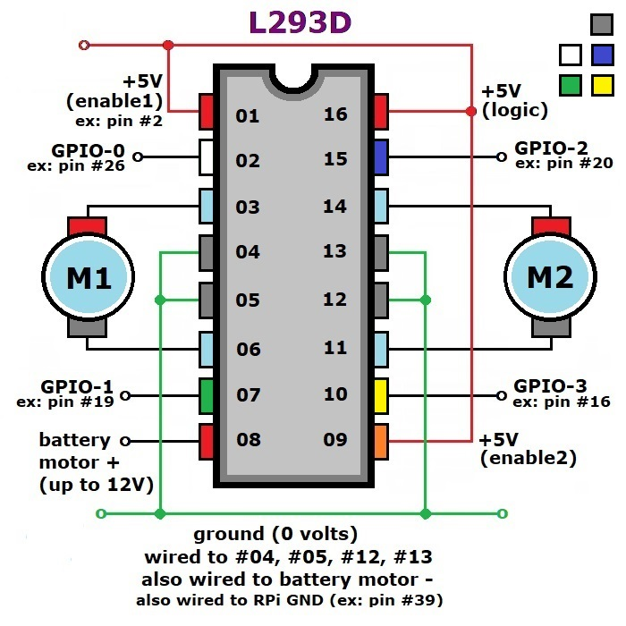

# raspberryPi

## robotics

see: [mamgeorge main altervista website](http://mamgeorge.altervista.org/)

see: [mamgeorge alternate google site](https://sites.google.com/site/mamgeorge)

intent:

	* control	: RPI_0w using NodeJs server to access GPIO Python code
	* travel	: Tamiya Track, Double Gearbox, 2 F130 DC Motors, L293D
	* movement	: 4 MG995 Servos, 2 subMicro Grippers, 2 HS55 Servos
	* sensing	: RPI 2.1 Camera, GearHead BT3500SLV Speaker, Microphone, Light
	* power		: Powered by rechargeable TL-PB 10400 & TL-PB 5200 mAh Powerbanks
	
	Currently designed to act as programmable sentry.
	Development below shows most recent first.

---
### robot 3

* MG995 Servos are intended to control armature via I2C on PCA9865.
* The PCA9865 will power all Servos from the TL-PB 10400.
* SketchUp 3D servo & tractor components were publically accessible.
* SketchUp 3D was used to create the Flanges & Grippers required.

* Steppers were compact, but required too many GPIO leads for a RPI 40 pin J8 form factor.
* My research suggests RPI timing is not very reliable for many I2C protocol calls.
* Both Actobotics "subMicro" Grippers were controlled by HiTec HS55 Servos.

---
### robot 2

* Includes RPI_0w, Track, L293D, Grippers, Camera, Speaker, Microphone, Light 
* The F130 DC motor power was changed to a TL-PB 10400 mAh Powerbank.
* Both Actobotics type "A" Grippers were controlled by HiTec HS311 Servos.
* The Camera is a RPi v2.1, the Speaker a GearHead BT3500SLV.
* Bluetooth Speaker used programmed phrases using ESpeak.
* Everything works, but no armature and limited Gripper functionality.

* LibreCad 2D CAD representation with BOM.

---
### robot 1

* Control is via SmartPhone thru NodeJs Server to activate Python GPIO code.
* Includes RPI_0w, Tamiya Track Gearbox, & L293D Controller.
* RPI_0w is powered by a TL-PB 5200 mAh Powerbank.
* F130 DC motors are powered by 4 AA cells.

* Pinout diagram of L293D Controller used for DC Motor PWM control.

---
### xtra

[markdown guide](https://www.markdownguide.org/basic-syntax/)
