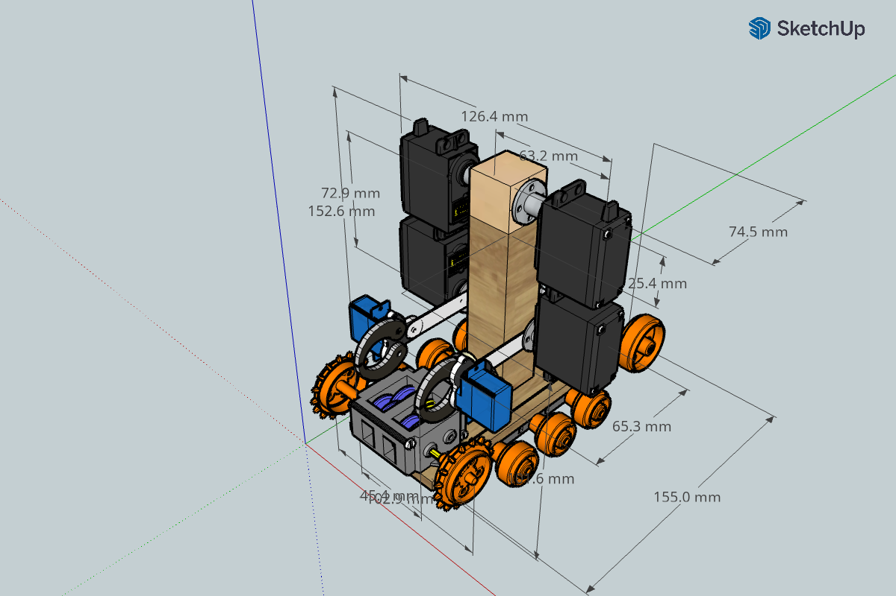

# raspberryPi

[mamgeorge main website](http://mamgeorge.altervista.org/)

[mamgeorge alternate site](https://sites.google.com/site/mamgeorge)

Steppers were not a valid configuration due to the pin requirements for the RPI.
Intent is to include functional armature.

Includes RPI_0w, Track, L293D, Camera, Speaker, Microphone, Grippers, Light

Includes RPI_0w, Track using L293D Controllers 

