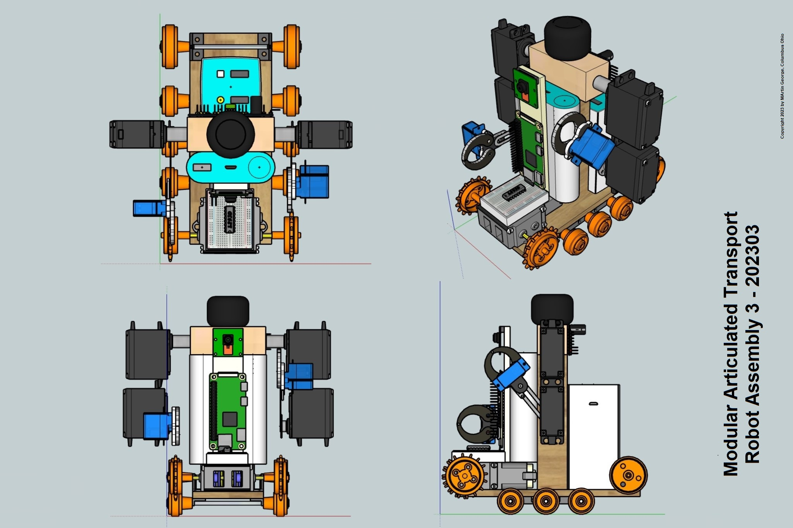
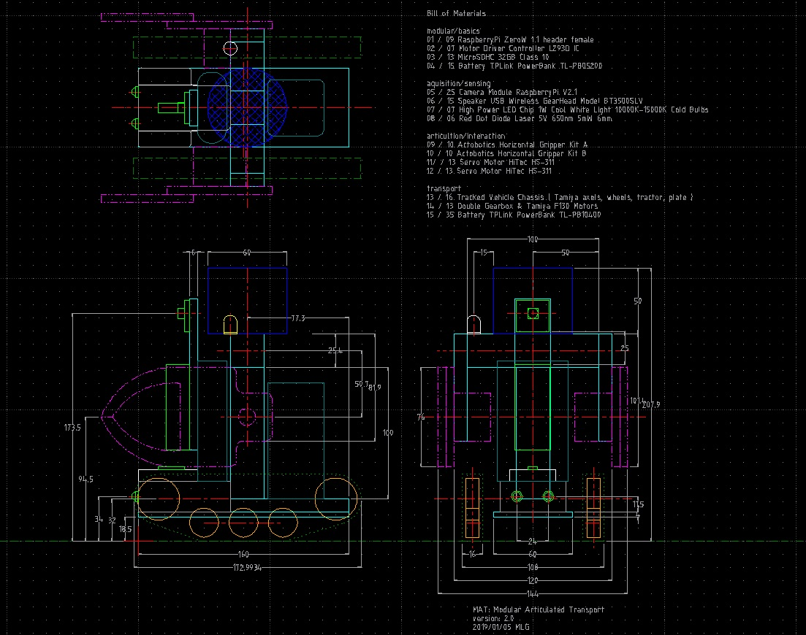
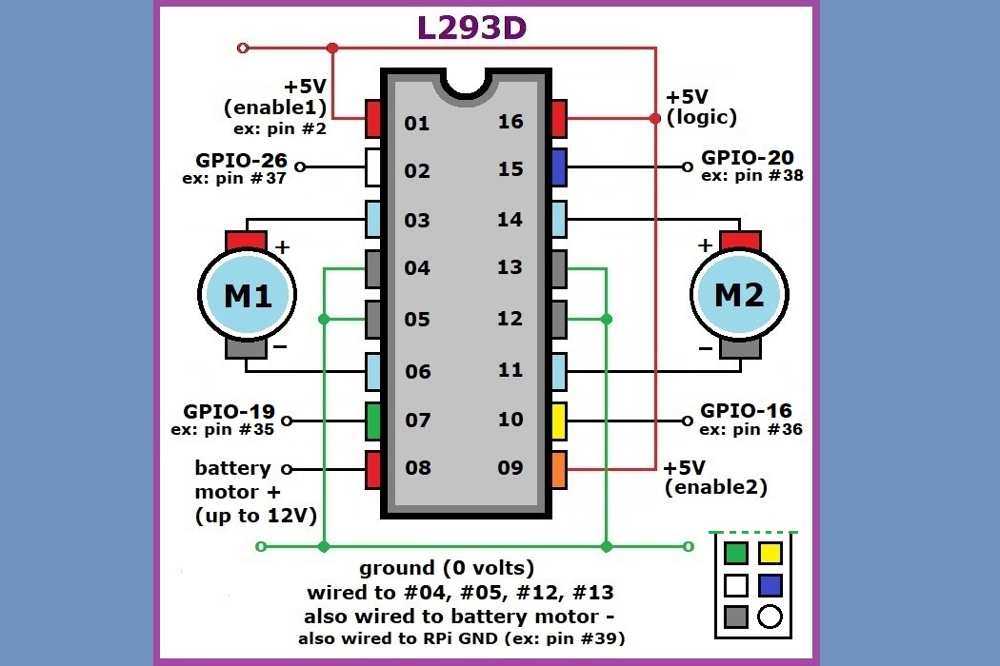

# RaspberryPi Robot Project
<table><tr>
<td></td>
<td>Technologies:

</td>
<td>Render: 

</td></tr></table>

## intent

	Currently designed to act as programmable sentry.

	🔹 control	: RPI_0w using NodeJs server to access GPIO Python code
	🔹 movement	: 4 MG995 Servos, 2 subMicro Grippers & HS55 Servos, PCA9685 I2C Controller
	🔹 sensing	: RPI 2.1 Camera, Insiq Bluetooth Speaker, Microphone MI-305
	🔹 travel	: Tamiya Track, Double Gearbox, 2 F130 DC Motors, L293D
	🔹 added	: 10 mm color LED, USB mini microphone
	🔹 power	: rechargeable TL-PB 10400 & TL-PB 5200 mAh Powerbanks

	Explores various inexpensive bare metal programming technologies. Future possibilities:

	▶️ completion of the I2C servo operation
	▶️ VAC (Voice Activated Commands) for more autonomous response
	▶️ simple AI NLP for generalized communication
	▶️ ESA AstroPi SenseHat for environment detection

	The descriptions below show the most recent developments first.

---
### robot 3 (MAT) / added Servo armature

Modular
* computer:	RPi0WF 1.1 SOC with BCM2835 cpu
* camera:	RPi Camera v2.1 with 8 Megapixel & 1080p resolution, PN: 2.1
* power:	TPLink PowerBank 5200 mAh, PN: TP-PB5200 (for RPi)
* software control:	Python & IDLE for DC motor PWM control
* software system:	Raspbian, Bash, Putty, WinSCP, GitHub...
* software server:	NodeJS, Express (JavaScript, HTML, CSS) for view

Articulation
* control:	PCA9685 16 Channel 12-Bit PWM Servo Motor Driver
* servos:	(4) Servo Motor, PN: MG995 (for shoulders, elbows)
* servos:	(2) Hitec subMicro Servo motor, PN: HS55 (replaces HS300)
* grippers:	(2) Actobotics subMicro Gripper Kit, PN: 637104 (replaces "A" Grippers)
* coupling:	(2) 25 Tooth (3F/H25T) Spline to 0.250 inch (replaces Servo Flanges)
* shafting:	(2) slotted set screw, 1/4" dia, 1" length (or M6 x 25mm+)

Transport
* control:	SN754410NE Controller DriveShield (replaces L293D)
* gearbox:	Tamiya Double Motorized Gearbox, PN: 70168 with (2) F130 DC Motors
* chassis:	Tamiya Tracked Vehicle Chassis, PN: 70108-1500
* power:	TPLink PowerBank 10400 mAh, PN: TP-PB10400 (replaces 4 AAs)

Peripherals
* speaker:		USB Bluetooth, Insiq PN: 4326595940 (replaces BT3500SLV)
? microphone:	USB mini microphone, PN: MI-305
? signal:		Color LED, 10 mm
? ligting		High Power LED, 1W, Cool White Light
? pointing		Red Dot Diode Laser, 6mm, 5V, 650nm 5mW

*The SketchUp 3D drawing required only new Coupling & Gripper drawings. 
All the other components were accessible online.* 
 

*Originally, the Steppers were used because they had an optimal fit & flexibility. 
However, they were not scalable; there were too many GPIO leads needed. 
A RPI 40 pin J8 form factor required a different addressing solution. 
Some websites suggest RPI timing is not reliable enough many protocol calls.* 
early attempts at steppers: (4) Stepper Motor 28BYJ48 (later removed) 
early attempts at controls: (4) ULN2003 Driver Board (later removed) 
early attempts at flanges: (2) Aluminum H25T gear, PN: ServoCity 525123 (later removed) 
see: "\\5Personal\Technology\raspberryPi\docs\projects_basics.txt" 
 

---
### robot 2 / added camera, grippers

* camera:	RPi Camera v2.1 with 8 Megapixel & 1080p resolution, PN: 2.1
* peripherals:	GearHead Bluetooth Speaker, PN: BT3500SLV
* peripherals:	USB mini microphone, PN: MI-305
* peripherals:	10 mm color LED
* power:	TPLink PowerBank 10400 mAh, PN: TP-PB10400 (upgrades 4 AA batteries)
* articulation:	(2) Actobotics Horizontal Gripper Kit "A", PN: 637094
* articulation:	(2) HiTec Servo motor, PN: HS300, with C24T or H25T spline

*The Grippers and Speaker worked, but proved to be clunky.* 
 

*The LibreCad 2D CAD representation with BOM.* 
 

---
### robot 1 / travel control via SmartPhone

* computer:	RPi0WF 1.1 SOC with BCM2835 cpu
* control:	L293D Controller DriveShield
* gearbox:	Tamiya Double Motorized Gearbox, PN: 70168 with (2) F130 DC Motors
* chassis:	Tamiya Tracked Vehicle Chassis, PN: 70108-1500
* power:	TPLink PowerBank 5200 mAh, PN: TP-PB5200 (for RPi)
* power:	(4) AA batteries in case (for DC motors)

*The RPi operates the L293D thru GPIO ports using Python PWM code signaled by a NodeJS server.* 
 

---
### software 
 os base:	Raspbian, Bash, Putty, WinSCP, GitHub... 
 control:	Python & IDLE for DC motor PWM control 
 server:	NodeJS, Express, (JavaScript, HTML, CSS) for view 
 drawing:	LibreCad 2D CAD, Sketchup 3D 

*The L293D Controller pinout diagram.* 
 

---
### xtra

[github image viewer](https://htmlpreview.github.io/) 
[stackoverflow github html discussion](https://stackoverflow.com/questions/8446218/how-to-see-an-html-page-on-github-as-a-normal-rendered-html-page-to-see-preview)

[HTML5 text folding](https://www.w3schools.com/tags/tag_summary.asp) 
[CSS&JS folding](https://levelup.gitconnected.com/collapsible-sections-with-or-without-javascript-3fd871955a9d)

[markdown guide](https://www.markdownguide.org/basic-syntax/)  
[collapsible markdown](https://gist.github.com/joyrexus/16041f2426450e73f5df9391f7f7ae5f)

Copyright 2021, Martin George, Columbus Ohio
